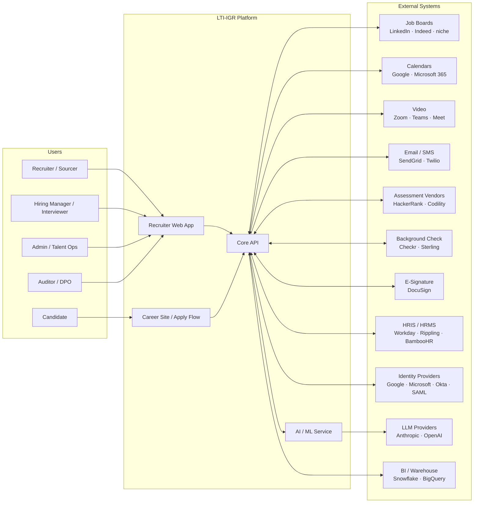
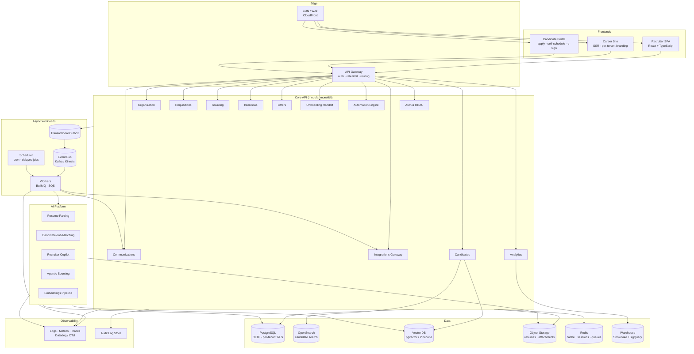
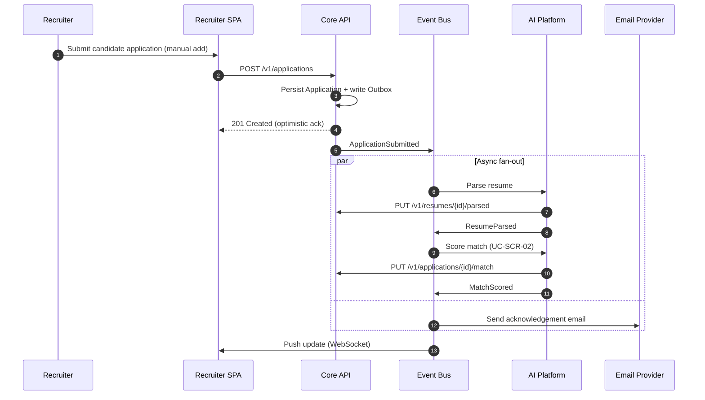
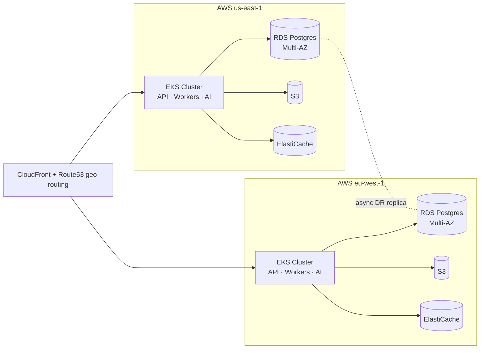

# LTI-IGR — System & High-Level Architecture

> **Document type:** High-level architecture design
> **Scope:** Whole LTI-IGR platform (AI-native ATS)
> **Companion documents:** [`../AGENTS.md`](../AGENTS.md) · [`README.md`](README.md) · domain `spec.md` and `design.md` files under [requisitions/](requisitions/), [candidates/](candidates/), [interviews/](interviews/)
> **Last updated:** 2026-05-23
> **Status:** v0.1 — Initial architecture baseline

---

## 1. Architectural Goals & Drivers

Derived from the strategic positioning in [`../AGENTS.md`](../AGENTS.md) (AI-native ATS for high-growth tech, 50–500 employees) and the MVP use cases in [`README.md`](README.md).

| # | Driver | Architectural implication |
|---|---|---|
| G1 | **AI-native** (copilot, matching, agentic sourcing) | First-class AI service layer; async pipelines; vector store; cost controls (caching, multi-model) |
| G2 | **Multi-tenant SaaS** | Tenant isolation enforced at data + auth layer; per-tenant config and branding |
| G3 | **Open ecosystem** (HRIS, calendars, job boards, assessments) | Public API + webhooks + integration adapters; marketplace-ready |
| G4 | **Compliance** (SOC2, GDPR, EU AI Act, NYC LL144) | Audit log, consent management, RBAC, data residency, AI explainability |
| G5 | **Recruiter-grade UX** (keyboard-first, fast) | SPA front-end, optimistic UI, real-time updates, sub-200ms p95 read latency |
| G6 | **Scalability** (10× volume without linear headcount) | Stateless services, horizontal scaling, async workers, event-driven core |
| G7 | **Time-to-market** (MVP in Q1) | Modular monolith first, extract services only where justified by scale or team boundaries |

---

## 2. Architectural Style

LTI-IGR follows a **modular-monolith-with-satellite-services** style, evolving toward selective microservices:

- **Core API** as a modular monolith organized by the functional domains defined in [`README.md`](README.md) §2: `auth`, `organization`, `requisitions`, `candidates`, `sourcing`, `assessments`, `interviews`, `communications`, `offers`, `onboarding-handoff`, `analytics`, `integrations`, `automation`. Each module owns its tables and exposes an internal contract; cross-module calls only via published interfaces.
- **Satellite services** for workloads with different scaling, security, or technology profiles: AI/ML service, parsing service, integrations gateway, async workers, and the public career site.
- **Event bus** for cross-module side-effects (notifications, analytics, AI triggers, integration outbox) — the backbone of the [Spec Conventions §7 "Published events"](README.md) listed in every domain spec.
- **CQRS-lite** in read-heavy areas (pipeline boards, analytics): write through the domain module, read from purpose-built projections.

Rationale: optimizes for G7 (speed) without painting the team into a corner on G6 (scale) and G3 (ecosystem).

---

## 3. System Context (C4 — Level 1)

**Actors** map 1:1 to the roles in [`README.md`](README.md) §1.
**External systems** are the table-stakes integrations called out in [`../AGENTS.md`](../AGENTS.md) §10 ("Minimum Viable Feature Set" and "Key Integrations").

---

## 4. Container View (C4 — Level 2)

---

## 5. Component Distribution

### 5.1 Frontends

| Component | Audience | Tech | Notes |
|---|---|---|---|
| **Recruiter SPA** | Internal users (R1–R6, R9) | React + TypeScript, Tanstack Query, Tailwind | Keyboard-first; optimistic UI; WebSocket for live pipeline updates |
| **Career Site** | Candidates (R7) | Next.js SSR | Per-tenant theming, SEO, programmatic landing pages |
| **Candidate Portal** | Candidates (R7) | Next.js | Apply flow, self-scheduling, status, e-sign, GDPR self-service |

### 5.2 Edge Layer

- **CDN/WAF** — static asset delivery, DDoS protection, geo-routing.
- **API Gateway** — TLS termination, JWT/session validation, rate limiting, per-tenant quotas, request routing to backend modules.

### 5.3 Core API (modular monolith)

Each module owns the entities defined in the corresponding domain `design.md`. Module-to-module communication is **synchronous via internal interfaces** for read paths and **asynchronous via domain events** for write side-effects. See §6.

| Module | Owns | Key external touchpoints |
|---|---|---|
| **Auth & RBAC** | `User`, `Role`, `Permission`, `Session`, `Invitation` | SSO IdPs (SAML/OIDC), MFA providers |
| **Organization** | `Tenant`, `Team`, `Brand`, `Settings` | Domain DNS, asset CDN |
| **Requisitions** | `Requisition`, `JobPosting`, `KnockoutQuestion`, `ApprovalChain` | Job boards (via Integrations Gateway) |
| **Candidates** | `Candidate`, `Application`, `Resume`, `MatchScore`, `TalentPool`, `Consent` | AI Platform (parsing, matching), Search & Vector stores |
| **Sourcing** | `SourcingCampaign`, `Lead`, `Referral` | LinkedIn, Chrome extension, AI agent |
| **Interviews** | `InterviewSchedule`, `InterviewKit`, `Scorecard`, `HireDecision` | Calendars, video, email |
| **Communications** | `Template`, `Message`, `Thread`, `NurtureCampaign` | Email/SMS providers |
| **Offers** | `Offer`, `OfferApproval`, `Signature` | E-signature, background check |
| **Onboarding Handoff** | `OnboardingPacket` | HRIS/HRMS |
| **Analytics** | Read models, dashboards | Warehouse |
| **Integrations Gateway** | OAuth tokens, connector state, webhooks | All third parties |
| **Automation Engine** | `WorkflowRule`, `Trigger`, `Action`, `Task` | Event bus, Scheduler |

### 5.4 AI Platform (satellite service)

Isolated from the Core API for independent scaling, GPU/inference cost control, and clean swap-in/out of providers.

| Component | Purpose | UC mapping |
|---|---|---|
| **Resume Parsing** | Extract structured skills/experience/education from CV | UC-CAND-02 |
| **Candidate-Job Matching** | Vector + outcome-trained ranking with explainability | UC-SCR-02 |
| **Recruiter Copilot** | JD drafting, candidate summaries, outreach drafting | Cross-cutting |
| **Agentic Sourcing** | Autonomous discovery + outreach with human-in-the-loop | Roadmap Q4 |
| **Embeddings Pipeline** | Backfill + incremental embeddings of candidates and jobs | Foundational |

Guardrails: every AI decision that affects a candidate (rank, reject, flag) writes to the `AIDecision` audit table with model version, prompt hash, inputs, outputs, and explanation — required by EU AI Act and NYC LL144 ([`../AGENTS.md`](../AGENTS.md) §10 risks).

### 5.5 Async Workloads

- **Event Bus** (Kafka or Kinesis): persistent, partitioned by `tenantId`, source of truth for domain events.
- **Transactional Outbox** in PostgreSQL: guarantees at-least-once delivery from write transactions to the bus.
- **Workers** (BullMQ on Redis for short jobs; SQS-backed workers for long-running): consume events, perform side-effects (send email, call AI, push to job boards, generate reports).
- **Scheduler**: cron-style jobs (digest emails, SLA escalations, GDPR purge sweeps, interview reminders — UC-INT-06).

### 5.6 Data Stores

| Store | Use | Why |
|---|---|---|
| **PostgreSQL** | OLTP for all modules | Strong consistency; row-level security for tenant isolation |
| **OpenSearch** | Candidate / job full-text + faceted search (UC-CAND-04) | Boolean + relevance ranking at scale |
| **Vector DB** (pgvector → Pinecone at scale) | Semantic match, similarity search | AI matching, talent rediscovery |
| **Object Storage** (S3) | Resumes, attachments, generated offers | Cheap, durable, signed-URL delivery |
| **Redis** | Cache, sessions, rate limits, BullMQ queues | Low-latency hot paths |
| **Data Warehouse** (Snowflake/BigQuery) | Analytics, DEI reports, customer BI | Decoupled from OLTP; long retention |
| **Audit Log Store** | Append-only audit trail | Compliance (SOC2/GDPR) — UC-AN-04 |

---

## 6. Communication Patterns

LTI-IGR uses four communication patterns, chosen by use case:

### 6.1 Synchronous Request/Response — REST + JSON over HTTPS

Used between frontends and Core API, and for module-to-module read paths inside the monolith. OpenAPI-described, versioned (`/v1`), idempotency keys on mutating endpoints.

### 6.2 Real-time Push — WebSocket / Server-Sent Events

Used for pipeline board updates, interview scheduling collision warnings, copilot streaming responses. Connection terminated at API Gateway, fanned out via Redis pub/sub.

### 6.3 Asynchronous Domain Events — Event Bus

Every domain spec under [`README.md`](README.md) §2 publishes events (see "Published events" section). Examples:

| Event | Producer | Consumers |
|---|---|---|
| `RequisitionApproved` | Requisitions | Integrations (post to boards), Communications (notify recruiter), Analytics |
| `ApplicationSubmitted` | Candidates | AI (parse + match), Communications (ack email), Automation |
| `MatchScored` | AI Platform | Candidates (persist), Automation (auto-advance/knockout) |
| `InterviewScheduled` | Interviews | Calendars, Communications (invites + reminders), Analytics |
| `OfferAccepted` | Offers | Onboarding Handoff (HRIS), Communications, Analytics |

Delivery: at-least-once via transactional outbox; consumers are idempotent.

### 6.4 Third-party Integration — Adapters & Webhooks

The **Integrations Gateway** is the only module that talks to external SaaS. Inbound webhooks (e.g., assessment completed, e-sign event, calendar update) hit a public endpoint, are verified (HMAC), normalized to internal events, and dropped on the bus. Outbound calls go through provider-specific adapters with retry, circuit breaker, and per-tenant OAuth token storage.

---

## 7. External System Integrations

Aligned with the integration roadmap in [`../AGENTS.md`](../AGENTS.md) §10.

| Category | Providers (priority) | Pattern | Direction |
|---|---|---|---|
| **Identity** | Google · Microsoft · Okta · generic SAML | OIDC / SAML | Inbound auth |
| **Calendars** | Google Calendar · Microsoft 365 | OAuth2 + webhooks | Bi-directional (UC-INT-01) |
| **Video** | Zoom · Microsoft Teams · Google Meet | OAuth2 + API | Outbound (create meeting) |
| **Job boards** | LinkedIn · Indeed · niche boards | XML feed + API | Outbound (UC-REQ-04) |
| **Email / SMS** | SendGrid · Postmark · Twilio | API + inbound webhooks (replies) | Bi-directional |
| **Assessments** | HackerRank · Codility · Codesignal | API + webhooks | Bi-directional (UC-SCR-03) |
| **Background checks** | Checkr · Sterling | API + webhooks | Bi-directional |
| **E-signature** | DocuSign · Dropbox Sign | API + webhooks | Bi-directional (UC-OFF-03) |
| **HRIS / HRMS** | Workday · Rippling · BambooHR · Gusto (via Merge.dev or Finch) | API + webhooks | Outbound on hire (UC-OFF-04) |
| **LLM providers** | Anthropic · OpenAI · self-hosted small models | API (with caching) | Outbound |
| **Analytics / BI** | Snowflake · BigQuery · Looker | Reverse-ETL + native connectors | Outbound |

**Public API & webhooks** — same surface the Integrations Gateway uses internally is exposed to customers and marketplace partners (G3). REST + OpenAPI, OAuth2 client credentials, per-tenant scoped tokens, signed outbound webhooks.

---

## 8. Cross-cutting Concerns

| Concern | Approach |
|---|---|
| **Multi-tenancy** | `tenantId` on every row, enforced by PostgreSQL Row-Level Security; tenant claim baked into every JWT and event |
| **Authentication & RBAC** | Central Auth module; resource-action-scope permissions; role templates per [`README.md`](README.md) §1 |
| **Audit & Compliance** | Append-only `AuditEvent` stream for every state change; AI decisions logged with explainability; GDPR right-to-be-forgotten cascades via soft-delete + scheduled purge (UC-CAND-09) |
| **Observability** | OpenTelemetry traces across API → workers → AI; structured logs with `tenantId` + `requestId`; metrics for funnel SLOs |
| **Secrets** | Cloud KMS-backed secret manager; per-tenant OAuth tokens encrypted at rest |
| **Data residency** | Tenant-pinned region (US / EU) selected at signup; events partitioned per region |
| **Idempotency** | Client-provided `Idempotency-Key` on mutating endpoints; deduplication keys on consumers |
| **Rate limiting & quotas** | At API Gateway, per-tenant and per-user; AI calls have a separate quota with bill-shock guardrails |
| **Feature flags** | Per-tenant flags for staged rollouts and pilot AI features |

---

## 9. Deployment Topology

- **Cloud:** AWS (primary), with portability through Kubernetes + Terraform.
- **Runtime:** EKS clusters per region (us-east-1, eu-west-1). Stateless services scale horizontally; AI Platform on GPU node pools.
- **Environments:** `dev` → `staging` → `prod`, with ephemeral preview environments per PR for the SPA + API contract.
- **CI/CD:** GitHub Actions → image registry → ArgoCD; database migrations gated by review and run before service rollout.
- **DR:** Multi-AZ active-active; cross-region async replication for OLTP; RPO ≤ 5 min, RTO ≤ 1 hour.

---

## 10. Tech Stack (proposed)

| Layer | Choice | Rationale |
|---|---|---|
| Frontend | React + TypeScript, Next.js for SSR sites | Ecosystem, hiring pool, SSR for SEO |
| Backend | TypeScript (Node/NestJS) **or** Go for hot paths | Type-safe, share types with FE; Go reserved for ingestion/matching |
| API style | REST + OpenAPI; GraphQL gateway for SPA aggregation (later) | Predictable; partner-friendly |
| Datastore | PostgreSQL · Redis · S3 · OpenSearch · pgvector | Battle-tested; defer Pinecone until scale |
| Event bus | Kafka (MSK) or Kinesis | Durable, partitioned, replay |
| Workers | BullMQ (short) · SQS + workers (long) | Mix matches workload profile |
| AI | Anthropic Claude (default) + OpenAI fallback + fine-tuned small models | Multi-model strategy ([`../AGENTS.md`](../AGENTS.md) §10 risks) |
| Auth | Cloud-hosted IdP (WorkOS / Auth0) + SAML/OIDC | SSO/SCIM out-of-the-box for enterprise |
| Observability | OpenTelemetry · Datadog | Single pane of glass |
| Infra | AWS · EKS · Terraform · ArgoCD | Standard cloud-native |

Stack choices are **proposals, not commitments** — they will be revisited per module once team and load profile are known.

---

## 11. Architecture Evolution Plan

| Stage | Trigger | Change |
|---|---|---|
| **MVP (Q1–Q2)** | Launch | Modular monolith + AI Platform + workers. Single region (US). pgvector. |
| **Scale-up (Q3–Q4)** | First enterprise + EU customer | EU region; extract Integrations Gateway and AI Platform if independent scaling required; move to Pinecone if recall/latency degrades. |
| **Platform (Year 2)** | Marketplace + 100+ partner integrations | Public API hardening; integrations marketplace; extract Communications and Analytics into independent services. |
| **Enterprise (Year 2+)** | Multi-entity + global compliance | Data residency tiers; pluggable AI providers per tenant; dedicated single-tenant deploy option. |

---

## 12. Open Questions

1. **Vector store** — pgvector long-term, or commit to managed Pinecone/Weaviate at MVP for talent-pool scale?
2. **Eventing** — Kafka (MSK) vs Kinesis: trade off operational complexity vs replay/tooling.
3. **HRIS connector strategy** — build directly, or use unified API (Merge.dev / Finch) — speed vs margin.
4. **Single-tenant vs pooled** for enterprise — required tier or sales narrative only?
5. **AI provider lock-in** — how deeply do we couple to Anthropic features (e.g., tool use, computer use) vs maintain provider neutrality?
6. **GraphQL gateway** — introduce in Q3 for SPA aggregation, or stay REST-only?

---

## 13. Changelog

| Version | Date | Change |
|---|---|---|
| 0.1 | 2026-05-23 | Initial high-level architecture: context, containers, components, communication patterns, integrations, deployment. |
